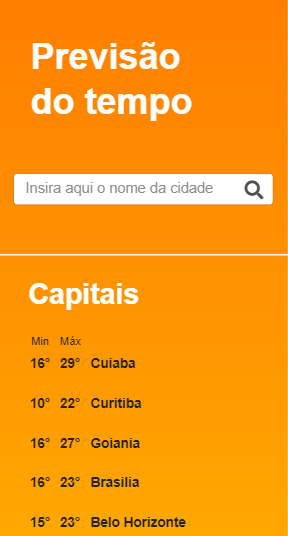
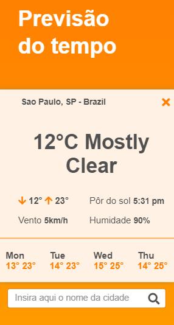

<h1>:open_file_folder: Front-End solution for the 1STi Challenge</h1>

My solution for front-end challenge proposed by 1STi ( https://github.com/1STi/desafio-frontend/ )

       

<h2>:computer: What is supposed to do?</h2>
<ol>
<li>Fetch Yahoo Weather API to show weather detail info based on a choosen city;</li>
<li>Responsive Design;</li>
</ol>

<h2>:toolbox: What did I use?</h2>
<ul>
<li>HTML 5;</li>
<li>CSS 3;</li>
<li>Javascript;</li>
</ul>

<strong><em>:star: No frameworks were used! :star:</em></strong>

<h2>:man_technologist: Features</h2>
<ul>
<li>Object-oriented programming;</li>
<li>Ajax (Fetch API);</li>
<li>Responsive Design;</li>
<li>DOM Manipulation;</li>
</ul>

<h2>:heavy_check_mark: Check the solution</h2>
$ git clone https://github.com/victorfclima/front-end-challenge-1STi-Weather.git
 
If you prefer, access: https://victorfranca-weather.netlify.app/
